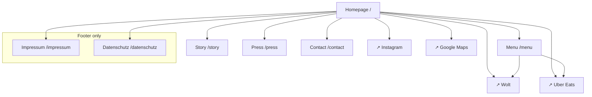

# Website Plan — whatajerk.berlin

*Goal: convert curious Instagram/Google visitors into walk-ins, Wolt orders, and followers.*
*Size: ~6 pages. Mobile-first. Fast-loading.*

---

## Primary Goals (in order)

1. **Convert** — "Order now" (Wolt / Uber Eats) or "Come visit" (map + hours)
2. **Inform** — menu, heat levels, story, allergens
3. **Rank** — for "Jamaican food Berlin", "jerk chicken Neukölln"

---

## Recommended Build

- **Stack:** Framer, Webflow, or Squarespace — any no-code builder
- **Why not custom code:** For a restaurant you need to update menu prices/hours 10x/year; a CMS makes that easy for non-coders. Save dev time for Ssam + What a Jerk ops.
- **Domain:** `whatajerk.berlin` (costs ~€25/year, feels local, available as of this writing — register now)
- **Backup:** `whatajerk.de` if `.berlin` is gone
- **Time to build:** 1 weekend for V1, 1 week for polished.

---

## Page Hierarchy

```
Homepage (/)
├── Menu (/menu)
├── Story (/story)
├── Press (/press)
├── Contact (/contact)
└── Impressum + Datenschutz (/impressum, /datenschutz)  [legal, required in DE]
```

Six pages total. No deeper levels — this is a restaurant, not a media site.

---

## Visual Sitemap



---

## URL Map

| Page | URL | Priority | Nav Location | SEO Target |
|------|-----|----------|--------------|-----------|
| Homepage | `/` | High | Header logo | "what a jerk berlin", "jamaican berlin" |
| Menu | `/menu` | High | Header | "jamaican food menu berlin" |
| Story | `/story` | Medium | Header | "jamaican restaurant berlin owner" |
| Press | `/press` | Low | Header | brand searches |
| Contact | `/contact` | Medium | Header | "jerk chicken kottbusser damm" |
| Impressum | `/impressum` | Required | Footer | — |
| Datenschutz | `/datenschutz` | Required | Footer | — |

---

## Navigation

### Header (sticky on scroll)

```
[LOGO]    Menu   Story   Press   Contact      [ORDER NOW ↗]
```

- Order-now button goes to: chooser pop-up asking "Wolt or Uber Eats?" → link out
- Mobile: hamburger icon, same items

### Footer

Three columns:

| Visit | Order | Follow |
|-------|-------|--------|
| Kottbusser Damm 96, 10967 Berlin | Wolt | Instagram |
| Mon–Thu + Sun 12:00–23:00 | Uber Eats | TikTok |
| Fri–Sat 12:00–01:00 | | |
| [Map link] | | |

**Legal strip** at bottom: © 2026 What a Jerk GmbH · Impressum · Datenschutz · AGB

---

## Homepage (`/`) — The Main Page

Because most visitors come via Instagram or Google and don't scroll past the fold, load the conversion above the fold. Everything else is support.

### Section 1 — Hero (above fold)

**Visual:** full-width hero video/image of the jerk chicken wrap being wrapped, or the grill. Dark warm lighting.

**Copy:**
> # Real jerk. Real heat.
> Berlin's first proper Jamaican quick-service spot. Kottbusser Damm 96.

**CTAs (two buttons side-by-side):**
- Primary (brand red `#CC0605`, white text): `Order on Wolt →` (or the chooser popup)
- Secondary (ghost, brand red border + text): `Visit us →` (scrolls to hours + map section)

**Micro-copy:** "Open today 12:00–23:00 · Fri–Sat till 01:00"

### Section 2 — Menu teaser

3-column card grid, visual, clickable:

| WRAPS from €8.50 | DISHES from €12 | PATTIES €3.50 |
|------|---------|---------|
| Jerk, Brown Stew, Curry Goat, Jackfruit, Fried Chicken | Oxtail, Jerk, Curry Goat, Brown Stew, Jackfruit | Beef, Chicken, Veggie |
| [hero photo] | [hero photo] | [hero photo] |

CTA: `Full menu →` → `/menu`

### Section 3 — "Pick your heat"

Horizontal row of 4 icons, text under each:

| 🌶 MILD | 🌶🌶 MEDIUM | 🌶🌶🌶 JERK | 🌶🌶🌶🌶 FULL FIRE |
|--------|-------------|--------------|-----|
| No scotch bonnet | Our default | Traditional heat | Ask us, mean it |

Sub-copy: "Say the word at the counter or write it in your order notes."

### Section 4 — Where + When

Split layout:

**Left:** embedded Google Map of Kottbusser Damm 96
**Right:**
> **Kottbusser Damm 96**
> 10967 Berlin, Kreuzberg
>
> **Hours**
> Mon–Thu + Sun · 12:00–23:00
> Fri + Sat · 12:00–01:00
>
> **Delivery**
> Wolt · Uber Eats
>
> [Get directions] [Order now]

### Section 5 — Story teaser

Photo of Ethan in the kitchen, short excerpt:
> "I'm Chinese, I'm Berliner, I'm not Jamaican — but I fell in love with jerk eating my way through Vancouver and Toronto. Years of research later, What a Jerk opened on Kottbusser Damm 96 in May 2026."

CTA: `Read the full story →` → `/story`

### Section 6 — Press (once earned)

Logo strip of any publications that cover you: The Berliner · tip Berlin · Mit Vergnügen · Berlin Food Stories · rbb24

Below: "Press coverage archive →" → `/press`

### Section 7 — Instagram feed

Embed live IG feed (most no-code builders have a widget). 6-image grid. Pulls the latest.

CTA: `@whatajerkberlin →`

### Section 8 — Final CTA band

Full-width, brand red `#CC0605` background, white text:
> **Hungry now?**
> Wolt delivers in ~20 min. Uber Eats too. Or walk in — we're open till 23:00 tonight.
>
> [Order Wolt] [Order Uber Eats] [Get directions]

---

## Menu Page (`/menu`)

Mirror of `.agents/what-a-jerk/copy/menu.md` with pricing.

**Structure:**
- Hero image (plated dish)
- Category sections: Wraps · Dishes · Patties · Sides · Drinks
- Each item: photo thumbnail · name (EN + DE) · short description · price · heat icon · (v) if vegan
- Allergen note at bottom: "Allergen info available on request — ask our team."
- Language toggle: EN / DE

**CTAs at top and bottom:**
- `Order on Wolt →`
- `Order on Uber Eats →`
- `Get directions →`

**SEO metadata:**
- Title: `Menu — What a Jerk | Jamaican QSR Berlin`
- Description: `Jerk chicken wraps €8.50, oxtail stew, curry goat, patties, jackfruit (vegan) and more. Real scotch-bonnet heat. Order on Wolt, Uber Eats, or walk in to Kottbusser Damm 96.`

---

## Story Page (`/story`)

The long version of the origin story. Optimized for casual readers, press, and people curious about the owner.

**Structure:**
1. Hero photo of Ethan in the kitchen or at the grill
2. Full origin narrative (500–800 words):
   - Born in China, restaurateur in Berlin
   - Vancouver: first tasted real jerk chicken
   - Toronto: went deep on the scene (Real Jerk, Rap's, Patty King, Rasta Pasta)
   - The gap in Berlin's food scene
   - Years of research, recipe testing
   - Why Kotti Damm
   - The Ssam connection
3. Sidebar: quick stats ("5 years eating jerk abroad · 2 years testing recipes · 0 shortcuts")
4. Photo grid: travel research photos, early testing photos, BTS
5. Final CTA: "Come taste it →" → `/menu`

**SEO metadata:**
- Title: `Our Story — What a Jerk | Berlin's First Jamaican QSR`
- Description: `From Vancouver and Toronto's Jamaican food scenes to Kottbusser Damm. The story behind What a Jerk, Berlin's first proper Jamaican quick-service restaurant.`

---

## Press Page (`/press`)

**Structure:**
1. Intro: "Writing about us? We'd love to help. Grab our press kit and get in touch."
2. Press kit download (PDF): logo, high-res photos, menu, press release, owner bio
3. Coverage so far (auto-updates as you earn it):
   - Logo + headline + date + link
4. Press contact: email + phone
5. Quote library — ready-to-use quotes from owner (see `copy/signage-and-press.md`)

**SEO metadata:**
- Title: `Press — What a Jerk | Press Kit & Coverage`
- Description: `Press kit, high-res photos, press release, and media coverage for What a Jerk — Berlin's first proper Jamaican quick-service restaurant.`

---

## Contact Page (`/contact`)

**Structure:**
1. Map (full width, embedded)
2. Address, hours, phone
3. Two simple forms:
   - **General inquiry** (name, email, message)
   - **Catering / private events** (name, email, date, guest count, message)
4. Press contact (separate block, different email)
5. "Join our newsletter" box — for opening specials + new menu items

**SEO metadata:**
- Title: `Contact — What a Jerk | Kottbusser Damm 96, Berlin`
- Description: `Visit What a Jerk at Kottbusser Damm 96, 10967 Berlin. Open daily from 12. Fri + Sat till 1am. Order delivery on Wolt or Uber Eats.`

---

## Legal Pages

### Impressum (`/impressum`)

Required by German law. Must include:
- Legal business name (GmbH, UG, Einzelunternehmen, etc.)
- Owner name
- Physical business address
- Contact: email + phone
- Trade register number (if applicable)
- USt-IdNr. (VAT ID)
- Verantwortlich für den Inhalt (responsible for content) — usually the owner

*This is not optional. Berlin has issued €5,000+ fines for missing Impressum. Consult your tax advisor for the exact text; templates from IHK Berlin are a safe starting point.*

### Datenschutz (`/datenschutz`)

Privacy policy. Required by GDPR. Must cover:
- Who you are + contact
- What data you collect (name/email via forms, cookies, analytics)
- Legal basis (GDPR Article 6)
- How long you keep it
- Users' rights (access, deletion, portability, complaint)
- Cookie policy + banner

*Use a generator like eRecht24 or Datenschutz-Generator.de. Have a lawyer review once.*

---

## Performance Targets

| Metric | Target | Why |
|--------|--------|-----|
| Lighthouse Performance (mobile) | > 90 | Google ranks slow sites lower |
| Largest Contentful Paint | < 2.5s | Hero image must load fast |
| Total page size | < 2 MB | Kotti Damm has lots of mobile data users |
| Accessible (WCAG AA) | Pass | Alt tags, color contrast, focus states |
| Mobile-first | 100% | 80%+ of traffic will be mobile |

### Image hygiene
- Compress all photos with TinyPNG or Squoosh before upload
- Use WebP format (1/3 the size of JPEG)
- Lazy-load images below the fold
- Hero image: < 300 KB

---

## Internal Linking Plan

| Page | Links to | Links from |
|------|----------|-----------|
| Homepage | Menu, Story, Press, Contact, Wolt, UE, IG | All pages (via logo + nav) |
| Menu | Homepage, Wolt, UE | Homepage, Footer |
| Story | Homepage, Menu | Homepage |
| Press | Homepage, Menu | Homepage |
| Contact | Menu | Homepage, Footer |

**Internal link rules:**
- Every non-home page has a CTA to either Order or Menu
- Story page links to Menu ("Come taste it")
- Menu page links to Wolt + UE (external)
- Contact page links to Menu

---

## Schema Markup (must-have)

Add JSON-LD schema on every page. Restaurant type is well-supported by Google → drives rich snippets.

**Schema types to include:**
- `Restaurant` (on homepage) — name, address, phone, hours, cuisine, price range, menu URL
- `LocalBusiness` (nested into Restaurant) — for Google Maps
- `Menu` (on menu page) — each menu section + item
- `Organization` (site-wide) — logo, social profiles
- `BreadcrumbList` (each inner page)

See `.agents/what-a-jerk/seo/` for full schema templates.

---

## SEO Essentials

### Homepage `<title>` + meta description

```html
<title>What a Jerk — Jamaican QSR on Kottbusser Damm, Berlin</title>
<meta name="description" content="Berlin's first proper Jamaican quick-service spot. Jerk chicken wraps €8.50, curry goat, oxtail stew, patties. Real scotch-bonnet heat. Open daily till 23:00, Fri/Sat till 01:00. Order on Wolt, Uber Eats, or walk into Kottbusser Damm 96.">
```

### Open Graph tags (for IG/WhatsApp link previews)

```html
<meta property="og:title" content="What a Jerk — Berlin's Jamaican Kitchen">
<meta property="og:description" content="Real jerk. Real heat. Straight from Kotti Damm.">
<meta property="og:image" content="https://whatajerk.berlin/og-image.jpg">
<meta property="og:type" content="restaurant">
```

`og-image.jpg` must be 1200×630 px, featuring the hero wrap shot + wordmark.

---

## Launch Day Website Checklist

- [ ] Domain registered and pointed to host
- [ ] SSL certificate active (HTTPS)
- [ ] Favicon installed (all sizes)
- [ ] All 6 pages live
- [ ] All CTAs go to correct destinations (Wolt/UE live links, not placeholders)
- [ ] Google Business Profile linked to website
- [ ] Google Analytics 4 installed (see `analytics/`)
- [ ] Meta Pixel installed (for future ads)
- [ ] Schema markup deployed + tested (schema.org validator)
- [ ] Impressum + Datenschutz live
- [ ] Cookie banner live (GDPR)
- [ ] Newsletter signup connected to Mailchimp (or similar)
- [ ] Sitemap.xml generated + submitted to Google Search Console
- [ ] Robots.txt configured (allow all, point to sitemap)
- [ ] Mobile test on real device (iPhone + Android, Chrome + Safari)

---

## V2 Features (post-launch, if budget/time allows)

- Online reservation (OpenTable, Resy, or simple email form)
- Gift cards (Square / Shopify)
- Catering menu page
- Job applications page (for hiring)
- Blog (only if you're committed to writing — otherwise skip; it hurts SEO to have a dead blog)
- Loyalty card signup → integrated with POS
- Multi-language toggle (EN + DE) — for V2 if bilingual menu in V1 isn't enough
