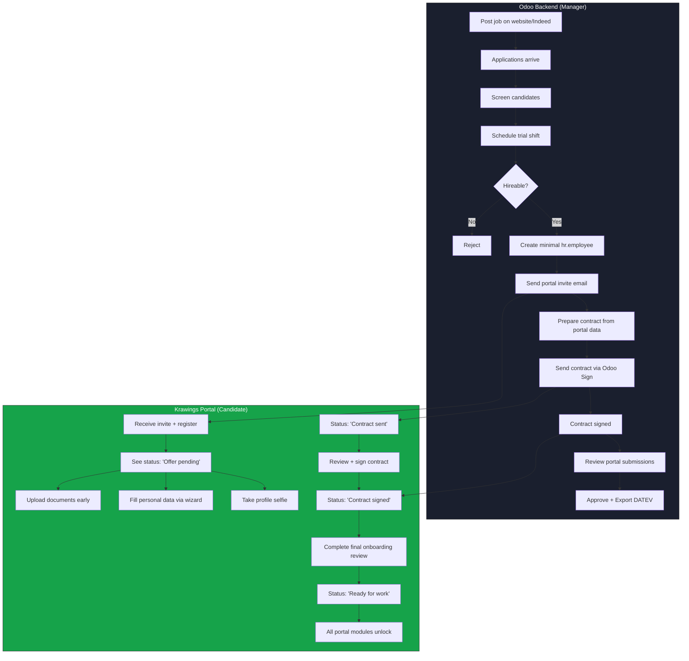

# Recruitment → Contract → Onboarding Workflow

## SSAM Korean BBQ (Krawings GmbH) — Berlin

---

## 1. Pipeline Overview



### The key insight

The portal is NOT just for employees — it's part of the recruitment process. As soon as a candidate passes their trial shift, they get portal access. By the time the contract is ready, most paperwork is already done.

**Time saved per hire:** Instead of spending the first week collecting documents and data, the candidate does it all before day 1. Manager just reviews, approves, and exports to DATEV.

---

## 2. What We Already Have (Portal Audit)

### Fully reusable — NO changes needed

| Component | What it does | Recruitment use |
|-----------|-------------|-----------------|
| `DocumentCapture.tsx` | Multi-image camera/file upload with preview, compress, Odoo Documents upload | CV, certifications, ID, tax docs — all 9 document types |
| `StepPersonal.tsx` | Name, DOB, gender, address (with autocomplete), phone (formatted), emergency contact | Candidate fills personal data pre-hire |
| `StepTax.tsx` | Steuer-ID, Steuerklasse, Konfession, Kinderfreibetrag with help popovers | Candidate fills tax info pre-hire |
| `StepInsurance.tsx` | SV-Nr, Krankenkasse, KV type with mandatory acknowledgment | Candidate fills insurance info pre-hire |
| `StepDocuments.tsx` | Document upload with Rote Karte info card, multi-file per type | Candidate uploads docs pre-hire |
| `StepConcurrentEmployment.tsx` | Nebentätigkeit declaration (Yes/No + details form) | Candidate declares secondary employment |
| `StepConsents.tsx` | 6 legal consent checkboxes (GDPR, IfSG, photo, confidentiality) | Final acknowledgments before submission |
| `StepReview.tsx` | Summary of all entered data + document status | Candidate reviews before submitting |
| `RoteKarteInfo.tsx` | Expandable info card with links for food hygiene certificate | Same — candidate sees this during doc upload |
| `UploadWidget.tsx` | Reusable "Take Photo / Choose Files" dual-button | Available for any upload need |
| `MyProfile.tsx` | Read-only view of all personal/tax/insurance data | Candidate can review what they submitted |
| `MyDocuments.tsx` | Document list with thumbnails, inline viewer, delete | Candidate manages their uploaded docs |
| `EmployeeOverview.tsx` | Manager view: search/filter employees by status | Manager reviews candidate submissions |
| `EmployeeDetail.tsx` | Manager view: full DATEV data + doc checklist + approve | Manager approves candidate data |
| `OdooClient` (`odoo.ts`) | JSON-RPC client for Odoo 18 | Can CRUD `hr.applicant`, `hr.job` today |
| `auth.ts` + `db.ts` | Session auth, role system, audit logging | Works as-is for candidates |
| All API routes | GET/PUT employee, GET/POST documents | Candidate uses same APIs |
| `krawings_hr_datev` module | 30 custom DATEV fields on hr.employee | Portal already writes to these fields |
| Odoo modules | `hr_recruitment`, `sign`, `hr_contract`, `documents`, `documents_hr`, `website_hr_recruitment`, `planning` | **All 7 already installed** |

### Needs adaptation — minor changes

| Component | Current state | Change needed |
|-----------|--------------|---------------|
| `OnboardingWizard.tsx` | 8-step wizard, all steps available | Lock steps 7-8 (Review + Consents) until contract signed |
| `HrDashboard.tsx` | Shows tiles: Profile, Onboarding, Documents, Help | Add status banner for candidates showing recruitment progress |
| `DashboardHome.tsx` | 10 module tiles, all visible to staff | Gate module access: candidates see only HR tile until hired |
| `AppDrawer.tsx` | Navigation with all modules | Hide non-HR links for candidates |
| Registration (`register/page.tsx`) | Matches by email against hr.employee | Works as-is — manager creates hr.employee first, candidate registers |
| `portal_users` table | Has `status` field (pending/active/rejected) | Use for candidate status tracking: `applicant → pending → active` |

### Needs to be built — new components

| Component | Purpose | Complexity |
|-----------|---------|------------|
| Status banner component | Shows "Contract being prepared" / "Contract sent" etc. on dashboard | Small — 1 component |
| Candidate gate logic | Conditional module access based on hiring status | Small — check employee `kw_onboarding_status` |
| Contract view card | Link to Odoo Sign URL from portal | Small — 1 card component |
| API: recruitment status | Read applicant stage from Odoo for status display | Small — 1 API route |

**Bottom line: ~80% of the recruitment portal is already built.** The onboarding wizard, document upload, auth system, and all UI components work for candidates without modification.

---

## 3. Job Posting & Applications

### Where to post jobs

| Channel | How | Effort |
|---------|-----|--------|
| **Odoo Website** | `website_hr_recruitment` is installed — publish jobs at your Odoo URL | Configure job descriptions, done |
| **Indeed** | Odoo 18 EE has no native Indeed integration. Options: (1) Indeed posts link to Odoo application form, (2) Manual import of Indeed applicants into Odoo, (3) Use Indeed MCP connector in Claude to monitor and import | Manual or semi-automated |
| **Social media** | Share Odoo job page link on Instagram, Facebook | Free, just share URL |
| **Walk-ins** | Manager creates applicant manually in Odoo | 2-minute task |

### Application form fields (restaurant-specific)

For the Odoo website job application form, configure these fields:

| Field | Type | Required | Why |
|-------|------|----------|-----|
| Full name | Text | Yes | Identity |
| Email | Email | Yes | Communication + portal invite |
| Phone | Tel | Yes | Quick contact |
| Position applied for | Dropdown | Yes | Kitchen / Service / Bar / Dishwasher |
| Availability start date | Date | Yes | When can they start |
| Work hours preference | Dropdown | Yes | Full-time / Part-time / Mini-job / Flexible |
| Work permit status | Dropdown | Yes | EU citizen / Valid work permit / Need sponsorship |
| German language level | Dropdown | No | None / Basic / Conversational / Fluent |
| Previous restaurant experience | Textarea | No | Background |
| CV / Resume | File upload | No | Attachment |

### Indeed integration

Ethan has the Indeed MCP connector in Claude. Recommended workflow:
1. Post jobs on Indeed with a link to the Odoo application form
2. Use Claude + Indeed MCP to monitor incoming Indeed applications
3. For promising candidates, manually create `hr.applicant` in Odoo with their details
4. This keeps Odoo as the single source of truth

---

## 4. Recruitment Pipeline for Restaurant

### Stage configuration in Odoo Recruitment

Set up these stages in Odoo → Recruitment → Configuration → Stages:

| # | Stage | What happens | Portal status shown |
|---|-------|-------------|-------------------|
| 1 | **New** | Application received, unreviewed | — (no portal access yet) |
| 2 | **Screening** | Manager reviews CV/application | — |
| 3 | **Trial Shift** | Candidate invited for paid trial (legally required in Germany) | — |
| 4 | **Hireable** | Passed trial → **portal invite sent** | "Application accepted" |
| 5 | **Contract Proposal** | HR prepares contract from portal data | "Contract being prepared" |
| 6 | **Contract Sent** | Contract sent via Odoo Sign | "Contract ready — please sign" |
| 7 | **Contract Signed** | Both parties signed | "Contract signed" |
| 8 | **Hired** | Applicant converted to employee, onboarding finalized | "Welcome aboard" |

### What happens at "Hireable" stage (the portal trigger)

This is the critical moment. When the manager moves an applicant to "Hireable":

1. **In Odoo:** Create a minimal `hr.employee` record from the applicant data (name, email, phone, department)
2. **In Odoo:** The applicant's email is now on an `hr.employee` record
3. **Send email:** Portal registration link to the candidate
4. **Candidate registers:** Using the EXISTING self-registration flow (matches by email → confirms identity → sets password → pending approval)
5. **Manager approves:** In portal admin panel, approve with role = `staff`
6. **Candidate starts onboarding:** All existing HR wizard steps are available

### Automation (Odoo server action)

Configure an automated action in Odoo:
- **Trigger:** When `hr.applicant` stage changes to "Hireable"
- **Action:**
  1. Create `hr.employee` with `name`, `work_email`, `mobile_phone`, `department_id`, `job_title` from applicant
  2. Set `kw_onboarding_status = 'new'`
  3. Send email template with portal registration URL

This can be configured in Odoo → Settings → Technical → Automated Actions (no code needed).

---

## 5. Portal Candidate Experience

### What the candidate sees at each stage

#### Stage: "Hireable" — Just got portal access

**Dashboard:**
```
┌─────────────────────────────────────────┐
│  🟢  Welcome, [Name]!                  │
│                                         │
│  Your application to SSAM Korean BBQ    │
│  has been accepted. Please complete     │
│  your onboarding below.                 │
│                                         │
│  Status: Offer pending                  │
│  ━━━━━━━━━━━━━━━━━━━━━━━━━━  40%       │
└─────────────────────────────────────────┘

┌──────────────┐  ┌──────────────┐
│ 📋           │  │ 📄           │
│ Onboarding   │  │ My Documents │
│ Step 2 of 8  │  │ 3/5 uploaded │
└──────────────┘  └──────────────┘
```

**Available:**
- HR & Onboarding wizard (Steps 1–6: Personal → Bank → Tax → Insurance → Documents → Concurrent Employment)
- My Documents (upload/view)
- My Profile (view what they've entered)

**Locked:**
- Step 7 (Review) — shows "Waiting for contract"
- Step 8 (Acknowledgments & Submit) — locked
- All other modules (Manufacturing, Purchase, Inventory, Recipes) — hidden

#### Stage: "Contract Sent"

**Dashboard shows:**
```
┌─────────────────────────────────────────┐
│  📝  Contract ready for signing!        │
│                                         │
│  Your employment contract has been      │
│  sent. Please review and sign it.       │
│                                         │
│  [Review & Sign Contract →]             │
│                                         │
│  Status: Contract sent                  │
│  ━━━━━━━━━━━━━━━━━━━━━━━━━━  75%       │
└─────────────────────────────────────────┘
```

The "Review & Sign Contract" button links to the Odoo Sign URL. The candidate signs in their browser — no Odoo account needed (Odoo Sign sends a unique signing link via email).

#### Stage: "Contract Signed"

**Dashboard shows:**
```
┌─────────────────────────────────────────┐
│  ✅  Contract signed!                   │
│                                         │
│  Please complete your final review      │
│  and submit your onboarding.            │
│                                         │
│  Status: Onboarding in progress         │
│  ━━━━━━━━━━━━━━━━━━━━━━━━━━  90%       │
└─────────────────────────────────────────┘
```

- Step 7 (Review) unlocks
- Step 8 (Acknowledgments & Submit) unlocks
- Candidate reviews all data and submits

#### Stage: "Hired" — Onboarding complete

- All portal modules unlock (Manufacturing, Purchase, Inventory, Chef Guide)
- Dashboard shows full tile grid
- Status: "Ready for work"
- Manager has reviewed and approved in EmployeeDetail screen
- DATEV export done, sent to Steuerberater

---

## 6. Contract Templates

### German employment contract requirements (Arbeitsvertrag)

Under the Nachweisgesetz (NachwG), every employment contract in Germany must include:

| Element | German term | Source |
|---------|-------------|--------|
| Employer name & address | Arbeitgeber | Company data |
| Employee name & address | Arbeitnehmer | **Portal data** (StepPersonal) |
| Start date | Beschäftigungsbeginn | HR enters |
| Workplace | Arbeitsort | Fixed: SSAM Korean BBQ, Berlin |
| Job title / description | Tätigkeitsbeschreibung | From `hr.job` |
| Working hours per week | Wochenarbeitszeit | HR enters |
| Probation period | Probezeit | Standard: 6 months |
| Compensation | Vergütung | HR enters (hourly rate or monthly) |
| Vacation days | Urlaubstage | Min 20 days (5-day week), standard 25-28 |
| Notice period | Kündigungsfrist | Standard: 4 weeks, during probation: 2 weeks |
| Fixed-term end date (if applicable) | Befristung | HR enters if applicable |
| Collective agreement reference | Tarifvertrag | If applicable |
| Social benefits | Sachbezüge | Meals, transit pass if offered |

### Templates needed for SSAM

| # | Template | Typical terms |
|---|----------|--------------|
| 1 | **Full-time kitchen** (Vollzeit Küche) | 40h/week, monthly salary, 6 months probation, 28 vacation days |
| 2 | **Part-time kitchen/service** (Teilzeit) | 20-30h/week, hourly rate, 6 months probation, pro-rata vacation |
| 3 | **Mini-job** (Geringfügige Beschäftigung) | Up to 538 EUR/month (2025) / ~556 EUR (2026), hourly rate, limited hours |
| 4 | **Working student** (Werkstudent) | Max 20h/week during semester, hourly rate |

### How contract templates work in Odoo Sign

1. **Create template:** Upload a German Arbeitsvertrag PDF in Odoo Sign
2. **Add signature fields:** Drag-and-drop fields for employer signature, employee signature, date
3. **Add auto-fill placeholders:** Map to `hr.employee` fields:
   - `{{employee.name}}` → filled from portal data
   - `{{employee.private_street}}` → filled from portal data (StepPersonal)
   - `{{employee.birthday}}` → filled from portal data
   - `{{employee.kw_steuer_id}}` → filled from portal data (StepTax)
   - `{{employee.kw_beschaeftigungsbeginn}}` → HR enters
   - `{{employee.kw_wochenarbeitszeit}}` → HR enters
4. **Send for signing:** Odoo generates a unique signing URL, sends by email
5. **Candidate signs:** In browser, no Odoo account needed
6. **Employer signs:** Manager signs in Odoo backend
7. **Fully signed:** PDF stored in Odoo Documents with tag "Arbeitsvertrag" (tag ID 52)

### Which fields auto-fill from portal data

| Contract field | Portal source | Wizard step |
|---------------|---------------|-------------|
| Employee name | `employee.name` | Registration |
| Date of birth | `employee.birthday` | Step 1: Personal |
| Address | `employee.private_street`, `private_zip`, `private_city` | Step 1: Personal |
| Tax ID | `employee.kw_steuer_id` | Step 3: Tax |
| Tax class | `employee.kw_steuerklasse` | Step 3: Tax |
| Social security # | `employee.ssnid` | Step 4: Insurance |
| Health insurance | `employee.kw_krankenkasse_name` | Step 4: Insurance |
| Bank IBAN | `employee.bank_account_id` | Step 2: Bank |

**Result:** When the candidate fills the onboarding wizard on the portal, the contract template can auto-fill ~10 fields. HR only needs to enter: start date, pay rate, hours, and department.

---

## 7. Contract Signing Flow

```
Manager in Odoo:
1. Recruitment → Applicant → "Send Offer"
2. Select contract template (e.g., "Vollzeit Küche")
3. Auto-filled fields from hr.employee (written by portal)
4. HR fills: start date, pay rate, hours
5. "Send" → Odoo Sign generates unique URL → email to candidate

Candidate:
1. Receives email: "Your employment contract is ready"
2. Clicks link → opens Odoo Sign in browser
3. Reviews contract (all personal data already correct — they entered it)
4. Signs with mouse/finger
5. Receives signed copy by email
6. Portal status updates to "Contract signed"

Manager:
1. Counter-signs in Odoo backend
2. "Fully Signed" status → contract PDF stored in Documents
3. Moves applicant to "Hired" stage
4. Portal unlocks final onboarding steps + all modules
```

### Portal integration with contract status

The portal can read the contract signing status from Odoo:

```
API: GET /api/hr/contract-status
→ Query hr.contract where employee_id = current user
→ Check sign.request status for the contract
→ Return: { status: 'none' | 'draft' | 'sent' | 'signed', sign_url: '...' }
```

This drives the portal status banner and the lock/unlock of wizard steps 7-8.

---

## 8. Post-Signing → Final Onboarding

After contract is signed:

1. **Portal:** Steps 7 (Review) and 8 (Acknowledgments & Submit) unlock
2. **Candidate:** Reviews all submitted data, checks all 6 consent boxes, hits "Submit for Review"
3. **Manager:** Opens EmployeeDetail in portal → sees all data + document checklist
4. **Manager:** Clicks "Approve" → sets `kw_onboarding_status = 'complete'`
5. **Manager:** Clicks "Export DATEV" → generates Personalfragebogen PDF
6. **Manager:** Sends PDF to Steuerberater
7. **Portal:** All modules unlock for the new employee
8. **Employee:** Can access Chef Guide, Inventory, Manufacturing, Purchase, etc.

### Sofortmeldung (immediate registration)

German law requires employers to register new employees with the Minijob-Zentrale or social insurance before the first day of work. The portal captures the necessary data (name, DOB, address, SV-Nr, insurance, start date). The manager exports this data and files the Sofortmeldung.

The existing field `kw_sofortmeldung_done` tracks whether this has been completed.

---

## 9. Technical Architecture

### Portal changes needed (by priority)

#### Priority 1: Candidate gate logic (Day 1)

No new pages needed — just conditional rendering:

```typescript
// In DashboardHome.tsx — check onboarding status
const isCandidate = employee?.kw_onboarding_status !== 'complete';

// Show only HR tile for candidates
const visibleTiles = isCandidate
  ? TILES.filter(t => t.id === 'hr')
  : TILES.filter(t => myLevel >= ROLE_LEVEL[t.minRole]);
```

#### Priority 2: Status banner (Day 1-2)

New component: `HiringStatusBanner.tsx`
- Fetches contract status from API
- Shows appropriate message + progress bar
- Renders at top of dashboard for candidates

#### Priority 3: Contract status API (Day 2)

New route: `GET /api/hr/contract-status`
- Reads `hr.contract` for current employee
- Reads `sign.request` status if contract exists
- Returns status + sign URL

#### Priority 4: Wizard step locking (Day 2)

In `OnboardingWizard.tsx`:
- Steps 1-6: Always available (candidate fills pre-hire)
- Steps 7-8: Check contract status → locked until signed
- Show lock icon + "Complete after contract signing" message

#### Priority 5: Odoo automation (Day 3)

Configure in Odoo backend (no code):
- Automated action: applicant → "Hireable" stage → create hr.employee + send email
- Email template with portal registration URL
- Contract template in Odoo Sign with auto-fill fields

### What's reusable (NO changes)

| System | Status |
|--------|--------|
| Self-registration flow | Works as-is — manager creates hr.employee, candidate registers by email |
| All 8 onboarding wizard steps | Work as-is for candidates |
| Document upload (9 types) | Works as-is |
| All API routes | Work as-is |
| Auth + role system | Works as-is (candidate = staff role) |
| Manager screens (EmployeeOverview, EmployeeDetail) | Work as-is |
| Odoo modules (recruitment, sign, contract, documents) | All 7 already installed |
| OdooClient | Model-agnostic, works with hr.applicant |
| krawings_hr_datev custom fields | Already on hr.employee |

---

## 10. Implementation Phases

| Phase | What | Effort | Dependencies |
|-------|------|--------|-------------|
| **Phase 1** | Configure Odoo recruitment pipeline (stages, job postings, email templates) | 1 day | None |
| **Phase 2** | Create 3-4 German contract templates in Odoo Sign | 1 day | Legal review of contract text |
| **Phase 3** | Configure Odoo automation: "Hireable" → create employee + send invite | 0.5 day | Phase 1 |
| **Phase 4** | Portal: Add candidate gate logic + status banner | 1-2 days | Phase 1 |
| **Phase 5** | Portal: Contract status API + wizard step locking | 1 day | Phase 2 |
| **Phase 6** | Test full flow on staging (application → contract → onboarding) | 1 day | All above |
| **Phase 7** | Production deployment | 0.5 day | Phase 6 sign-off |

**Total estimated effort: 5-7 days**

Most of the work is Odoo configuration (phases 1-3), not portal development. The portal needs only ~3 new components and 1 API route.

---

## 11. Open Questions for Ethan

### Recruitment process
1. **How many interview rounds?** Recommendation: phone screen → trial shift (for kitchen). Just trial shift for dishwasher.
2. **Should trial shifts be paid?** Legally required in Germany — yes. How many hours? (Typical: 4-8 hour shift)
3. **Who reviews applications?** Ethan only, or also kitchen manager / service manager?
4. **When exactly should candidate get portal access?** Recommendation: after passing trial shift ("Hireable" stage)

### Job postings
5. **Which positions are you hiring for?** (Kitchen, service, bar, dishwasher, management?)
6. **Indeed vs Odoo website vs both?** Indeed for reach, Odoo for tracking — can do both
7. **Website for jobs:** pos.krawings.de or separate careers page?

### Contracts
8. **Standard pay rates per contract type?** Needed for templates (hourly kitchen, hourly service, mini-job rate)
9. **Standard working hours?** 40h full-time? Typical part-time hours?
10. **Benefits offered?** Staff meals (Sachbezug)? Transit pass? Tips policy?
11. **Do you have existing contract templates?** From your Steuerberater or lawyer?

### Communication
12. **WhatsApp notifications to candidates?** You have Meta Business API. Want status updates via WhatsApp at each stage?
13. **Email language:** German only, or English + German for international staff?

### Technical
14. **Should contract be viewable inside portal, or is email link to Odoo Sign sufficient?** Recommendation: link is simplest and works well
15. **Do you want candidates to see other candidates' status?** (No — never. Just their own.)

---

## Appendix: Data Flow Diagram

```
CANDIDATE                    PORTAL                      ODOO
────────                    ──────                      ────
Apply (website/Indeed)  ────────────────────────>   hr.applicant created
                                                   Stage: New → Screening

Trial shift             ────────────────────────>   Stage: Trial Shift

                                                   Manager: Stage → Hireable
                                                   ↓ Automation:
                                                   1. Create hr.employee
                                                   2. Send portal invite email

Register on portal     ──>  portal_users created
                            status: pending
                            ↓ Manager approves
                            status: active

Fill personal data     ──>  PUT /api/hr/employee  ──>  hr.employee updated
Upload documents       ──>  POST /api/hr/documents ──>  documents.document created
Fill tax info          ──>  PUT /api/hr/employee  ──>  hr.employee kw_* fields

                                                   Manager: Prepare contract
                                                   hr.contract created
                                                   Odoo Sign → send to candidate

Sign contract          ──>  (Odoo Sign URL)       ──>  sign.request → signed
                                                       hr.contract → running

Review + submit        ──>  PUT /api/hr/employee  ──>  kw_onboarding_status
                            (Steps 7-8 unlock)         = 'complete'

                                                   Manager: Approve in portal
                                                   Export DATEV → Steuerberater
                                                   File Sofortmeldung

First day of work! 🎉
All portal modules unlock
```
